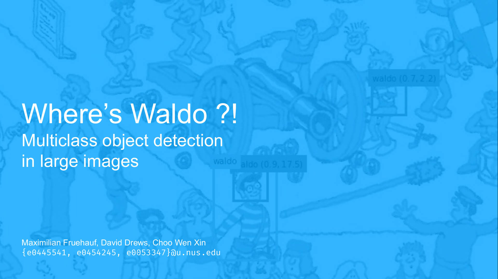

# Where's Waldo Object Detection in large images

This document explains how setup our project so that you can reproduce our classification results and retrain our model.

For more details see the [slides](slides.pdf) or the [full report](report/paper.pdf).

## Basic Steps

1. Run the Jupyter notebook *preprocess_samples.ipynb* step by step.
	
	- The third code block contains variables you can adjust.
	
2. Run the Jupyter notebook *train_detector.ipynb* step by step

	- For testing our solution on the hold-out set please do not change the `TRAIN_MODEL` parameter. We've already provided you with a classifier that we've trained on all available data which will be used if you don't train a new classifier.
	- Unfortunately, as we've trained the classifier on a computer running Mac OS X Mojave, you might not be able to load it on a Windows machine.
	- In order to train the model that we've based the numbers in our report on, you have to set this parameter to `True`. Its performance is worse then the provided model as we could not train it on the validation set.
	