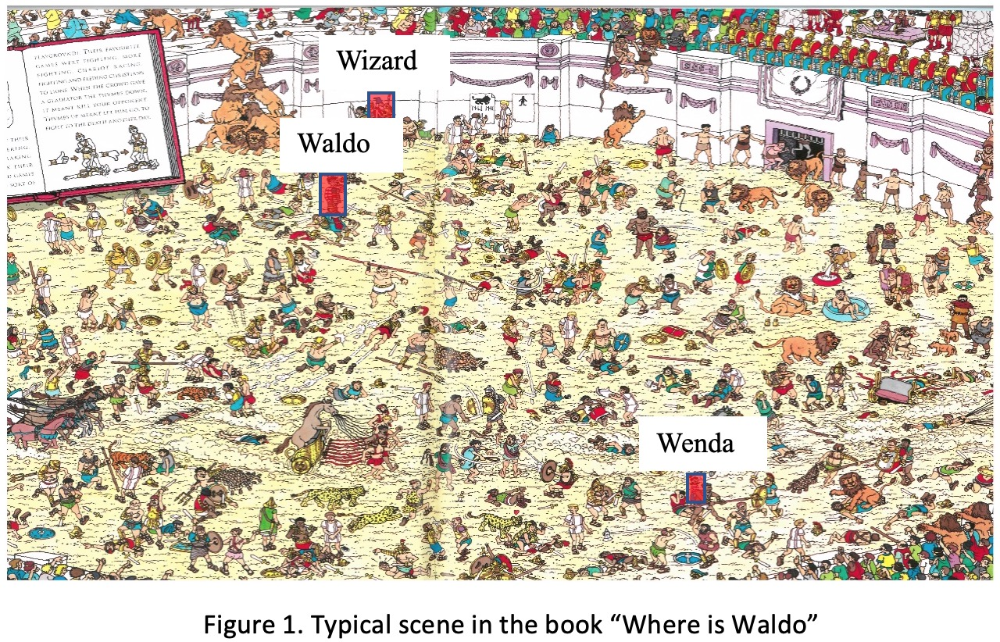
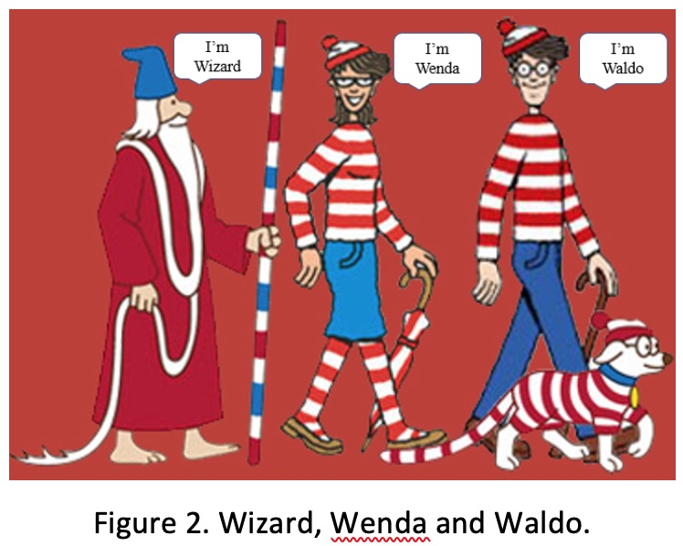

#Where’s Waldo?



## Introduction.
After 5 intense lectures of computer vision (with more to come!) you must be eager to try something interesting with the skills you learned from the class!

“Where’s Waldo” is a series of Wimmelbilder books featuring Waldo , along with his friends who set off on “a-world-wide hike”. The books feature a series of detailed illustrations (see Fig.1 for an example) and your job is to find Waldo and his friend Wenda and Wizard (see Fig. 2 to get to know them!).



We have scanned the images from the books and your task is to detect three of the characters (Waldo, Wenda and Wizard) in each scene using any non-deep computer vision algorithm of your choosing.

To facilitate your job, we provide you some annotated samples, which we painstakingly hand labelled. However, the annotations are not so perfect, and certain characters are hard to find sometimes. So, you are welcome to improve the annotations yourself, or search for online resources to help you. The format of the annotations follows the Pascal VOC standard, and the location of the object is given by (xmin, ymin, xmax, ymax) which denotes the top left and bottom right of the bounding box. Please refer to the annotation file for the specifics.

## Evaluation Metric

We adopt the mean average precision (mAP) as metric to evaluate your algorithm’s performance. We regard the 3 characters as 3 classes and for each class, we calculate the average precision based on the ground-truth and detected characters. You can read more about mAP here:

[medium](https://medium.com/@jonathan_hui/map-mean-average-precision-for-object-detection-45c121a31173)

We have provided the evaluation script. Note that your algorithm’s efficiency and novelty will also be counted into the final grade flexibly.

# Requirement

You are free to propose and implement your own algorithms to address the problem. We have a separate hold-out test set to compare your algorithm’s performance with everyone else in the class. Please submit your code and format your outputs as suggested in ‘REDAME.md’ and also submit a detailed readme file to ensure that the TAs can run your code successfully.

# Don’t know where to start?

(1) Brute-force it! What about a normalized cross-correlation approach as described in Lecture 2. Hint: this method is will be very slow and unlikely to return Waldo (or Wenda or Wizard) as the top hit.
(2) Interest Point Matching. What about detecting interest points and finding matches in the images? See Lecture 5 / 6, similar to Lab 3.  
(3) Detectors?
(4) Classifiers?

# Grading Scheme

Mid-term Report (10%) Due 17.10.
½ to 1 page progress report, detailing your progress to date (what have you tried so far) and the contributions of each team member to date. This is to ensure that you do not leave things to the last minute.

Final Report (25%) Due 07.11

- Description of rationale behind methodology,
- Theory behind the method
- experiments tried with quantitative evaluations
- contribution of each team member.
- Please also describe the experiments that you tried which did not work and explain why it fails!

Implementation (40%) Due 07.11 with final report.
Documented source code that runs out of the box. You can use any “non-deep” method that you want, so long as you are able to concisely explain in your report and presentation how that method works.

Presentations (25%) done in lab session on 12.11 and 15.11.  
10-15 minutes, highlighting the main points from your final report.

Bonuses (tbd)
We will give bonus marks for the fastest / most innovative / most accurate solutions.

# Details

This project aims to encourage students to propose and implement their own algorithms to detect characters of interest
in images that you would find in the Where's Waldo books.

To facilitate the detection task, we release training and validation data for you to work with and test your algorithm's effectiveness. Our images are scanned from the "Where's Waldo" books and we don't have copyright so please do not distribute the images online.

In 'datasets/', you will find 'JPEGImages/' and corresponding 'Annotations/'. The image splits (our recommended training and validation split) are are given in 'ImageSet/'. You can visualize the annotations with the provided script 'vis_anno.py'

We provide baseline detection results in 'baseline/' for each of the three characters ('waldo', 'wenda', 'wizard')
on the validation set and an evaluation script to quantify the performance. We follow the standard metric of mean
average precision (mAP) and use a threshold of 0.5 as the minimum overlap between the predicted bounding box and
the ground truth bounding box. Please run the script 'evaluation.py' to see the baseline results.

As mentioned in lecture, we give bonus marks for the fastest / most innovative / most accurate solutions. For a fair comparison, we will test your algorithms on hold-out test set. Therefore, for this project, you need to submit your code, along with a readme file to help the TAs run your code.

For your inputs, any input format that follows the provided directory structure is OK. Please refer to the files under 'baseline/' to format your outputs. Specifically, please separately save the predictions for each of the three characters, and strictly name them as 'xx.txt', where xx is the character name (wizard, wenda, waldo). Each row in a file denotes a predicted bounding box, and is given by:

```
image_name score xmin ymin xmax ymax
```

where 'score' denotes the prediction confidence of the bounding box represented by [xmin, ymin, xmax, ymax], i,e,. the top left and bottom right of the rectangle.

I suggest to use pycharm for this project. Any other questions, please put them on project channel in Slack.

Good Luck
Junbin
